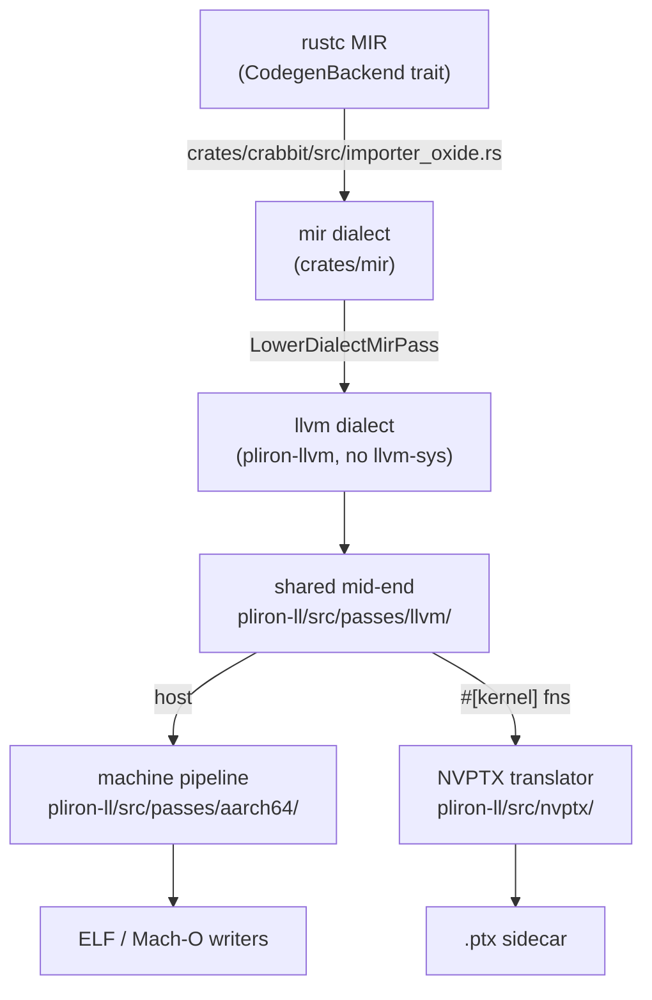
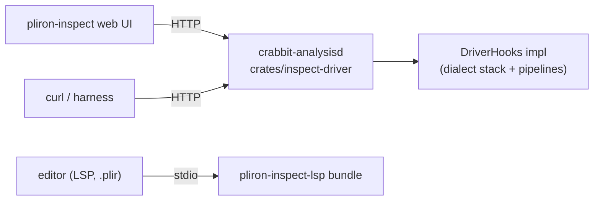

# Architecture

crabbit is a rustc codegen backend built as a stack of
[pliron](https://github.com/pliron-org/pliron) dialects and passes, plus a
toolchain (server, profiler, harness) built on the same stack. This
document maps the pipeline to the actual modules.



## 1. Import: MIR → `mir` dialect

`crates/crabbit/src/importer_oxide.rs` walks the crate's monomorphized MIR
and builds a `mir`-dialect module (`crates/mir`). Constants (including
pointer-carrying allocations), TLS, virtual calls, i128, and overflow
intrinsics are resolved here. Functions whose symbol starts with
`__stair_kernel_` go to a separate `rust_kernels` module
(`docs/KERNEL-ABI.md`).

## 2. Shared mid-end (`crates/pliron-ll/src/passes/llvm/`)

One pass list (`add_llvm_midend_passes`) serves the host pipeline, the
kernel pipeline, and the analysis server, so they cannot drift:

```
inline → simplify/simplify-cfg → 2 × (SROA → mem2reg → simplify rounds)
→ gvn → div-strength-reduce → licm → gvn
→ global-dse → adce → sink
→ final simplify/simplify-cfg/simplify
```

- `analysis.rs`: dominators (pliron's CHK), post-dominators, natural loops,
  a generic backward bitset dataflow — differential-tested against the
  `combinatorial-matrix-theory` boolean-matrix formulations (dev-dep only).
- `gvn.rs` / `dse.rs` share one conservative syntactic alias model
  (`AddrKey`).
- Profitability is parameterized by **`TargetProfile`**
  (`pliron-ll/src/target_profile.rs`) — a miniature TargetTransformInfo.
  First consumer: `sink.rs` refuses to add control dependence when
  `has_branch_divergence` (SIMT executes both sides of a divergent guard;
  measured +10% regression on `gemm_tiled` before the rule, see
  `MIDEND-PLAN.md`).
- Each research pass self-ablates via `CRABBIT_MIDEND_DISABLE`
  (`midend_gate.rs`).

## 3. Machine pipelines and the target registry

`pliron-ll/src/targets.rs` is an LLVM-style registry: a `Triple` resolves
to a `TargetBackend` bundling a pipeline and an object writer. The aarch64
pipeline (`passes/aarch64/mod.rs`):

```
verify → abi → isel (llvm_to_aarch64_isel.rs) → legalize
→ machine-cfg-cleanup → target-opts-pre-ra
→ [blockmap/op-id stamping]
→ REGISTER ALLOCATION        ← swappable slot (pipeline_with_allocator)
→ frame-lower → post-ra-opts → block-placement → branch-relax
→ asm-lower → encode
```

ELF/Mach-O translation happens outside the pass pipeline
(`aarch64_object_lower.rs`, `elf.rs`, `macho.rs`), like the PTX writer.

**Allocator swap**: the RA slot accepts any pass meeting the baseline's
postconditions. `crates/research-config` (features `eregalloc`, `cmt`)
parses `CRABBIT_REGALLOC`/`_ORACLE`/`CRABBIT_BLOCK_FREQ` and constructs the
`eregalloc-passes` allocator (e-graph availability oracle) with a frequency
source: uniform, analytic spectral (Perron–Frobenius,
`passes/spectral_freq.rs`), or a **measured profile**
(`passes/profile_freq.rs`, fed by `CRABBIT_PROFILE`).

## 4. GPU kernel path

Kernel functions take the same mid-end (with
`TargetProfile::gpu_kernel()`), then `pliron-ll/src/nvptx/mod.rs`
translates llvm-dialect functions **directly to PTX text** — no NVVM, no
LLVM; ptxas does register allocation downstream. Integers, f32/f64,
`.shared` memory (via `#[link_section = ".shared"]` statics), barriers,
atomics, and the NVVM math/sreg intrinsics are covered; unsupported
constructs error by name. `CRABBIT_LL_OUT` additionally exports the same
module as textual LLVM IR (`crates/crabbit/src/kernel_llvm_export.rs`) so
the identical front half can be compiled by `llc` — the apples-to-apples
"rust-llvm" comparison arm.

## 5. Provenance & profile attribution layer

The substrate of [BACKWARD-PGO.md](BACKWARD-PGO.md):

- `llvm-op-ids` stamps every mid-end-input op; each transforming pass
  records its **adjoint** (`ll.derived_from`, multi-parent
  `ll.derived_from_many`, `ll.inlined_from`) next to its own code.
- The machine boundary (`passes/aarch64/opmap.rs`) re-stamps: isel brackets
  every emitted machine op with its source op; RA/frame/placement stamp
  the code they create (or named synthetic roots: `isel:abi`, `regalloc`,
  `frame`, `placement`).
- Sidecars: `<obj>.blockmap.json` (blocks + per-op byte ranges +
  provenance) for the CPU; `<ptx>.linemap.json` (PTX line → source op) for
  the GPU. Both gated (`CRABBIT_BLOCKMAP` / `CRABBIT_PTX_LINEMAP`) and
  verified not to perturb codegen.
- Ingest: `scripts/perf-harness/profile_ingest.py` (perf) and
  `kernel-corpus/tools/ncu_ingest.py` (Nsight Compute) both emit one
  `op_costs.json` shape with costs at machine, lifted, and source levels.
- Consumers: the eregalloc oracle (`CRABBIT_MEASURED_COSTS`), the server's
  `run_costs` heat tables, and the analyses under `kernel-corpus/results/`.

## 6. The analysis server



`crabbit-analysisd` implements the `DriverHooks` trait from
`pliron-inspect`'s driver library and speaks its line-JSON protocol
(stdio; `--http` adds a loopback shim over the same handlers). Runs execute
pass-by-pass on a worker pool with progress and cancel; per-pass IR is
served by **deterministic replay** (re-run the first k passes) or captured;
`run_costs` replays a run while walking measured costs backward through the
provenance chain. Server-built objects are **byte-identical** to the rustc
path for the same module and config (`crates/inspect-driver/tests/`).

## 7. Verification & measurement

- `crates/backend-tests`: builds the real dylib, compiles fixture crates
  through it, **executes them**, and checks output — including a GPU kernel
  fixture run via the CUDA driver API, IR round-trip fixpoint, and the
  server-equivalence gates. Runs under both allocator engines.
- `crates/pliron-ll/tests/opmap_audit.rs`: attribution fidelity audits
  (E3) — injected samples must lift to the correct source op through the
  full pipeline, including a 50/50 GVN-merge split.
- `scripts/perf-harness/`: config-matrix A/B over fixtures + arrow-rs +
  the kernel-corpus CPU variants; miscompile gates; objdump spill metrics
  (whole-object and per-kernel-function); backend snapshotting so a sweep
  can never mix compiler versions.
- `../kernel-corpus`: 14 kernels × {Rust device, Rust CPU, CUDA C++, spec}
  with checksum gates; the three-arm GPU comparison
  (`tools/run_all.py`); the attribution and feedback experiments with all
  raw CSVs.
